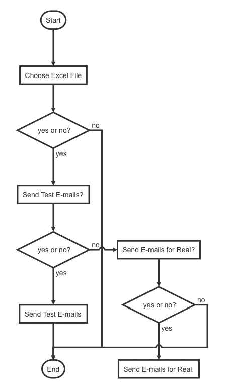

# `emailMadness`

<center style='color:darkred'>
Mass, Individualised E-mails with Python with
</center>

## What `emailMadness` does

* This simple Python programme (`emailMadness_mac`, `emailMadness.py`) goes through an Excel file and sends e-mails directly using the NUS mail server. 
* Here are some of the features:

  1. You can CC and BCC as many individuals as you like.
  2. You can attach a file (a single file at present).
  3. You can have a plain text message or an HTML message (with rich text, images and CSS).
  4. The messages can be individualised. For example, this means you can send different files to different people.

## Usage

### Setup

* The Excel file needs to have three sheets named **Message**, **Sender** and **To**. 
  Please refer to the template Excel file [email-info.xlsx](./email-info.xlsx)
* You can create your message with variables using the syntax **{VARIABLE_NAME}**. These will be replaced later with the appropriate values from the Excel ('To') sheet. The **{}** are important.
* You **must** have a column corresponding to each of the variables in the Excel sheet. 
  Kindly refer to the template Excel file 'email_info.xlsx'
* For example `NAME` and `MARKS` are the two variables that will be individualised:

```
Dear {NAME},

Thank you for participating in our workshop. 

You have scored {MARKS} in the finals test.

Best,

Kermit
```
* Email addresses in the lists (i.e. TO, CC & BCC) must be **comma separated**.

  * E.g. kermit@muppets.com, piggy@muppets.com, grover@muppets.com

    
### Notes

1. Note that the **test e-mails are sent to you** and **not to any outside recipient**.
1. There will be a log file (**email-log.txt**) created that logs all the sent e-mails.
1. If you can have a CC or BCC column, that is empty.

### Running the programme

There three ways you can run the programme.

1. Open the file `emailMadness.py` in your editor and run the function `driver()`

2. Use the terminal  `python emailMadness.py`

3. Download the ready-made executable (shown below) and just double click.

   * Note that the executable is very big ($\approx$ 270 Mb) because it has all the Python dependencies included.

### Download

|        OS         |       Filename       |  Size  | Link |     Where     |
| :---------------: | :------------------: | :----: | :--: | :-----------: |
| Mac OS Executable | `emailMadness_mac` | 264 Mb | [Download](http://sps.nus.edu.sg/tools/downloads/emailMadness_mac) |  SPS Server   |
|    python file    | `emailMadness.py`  |   -    | [Download](./emailMadness.py) | This git site |

### Flow

The logical flow of the programme is shown below.



